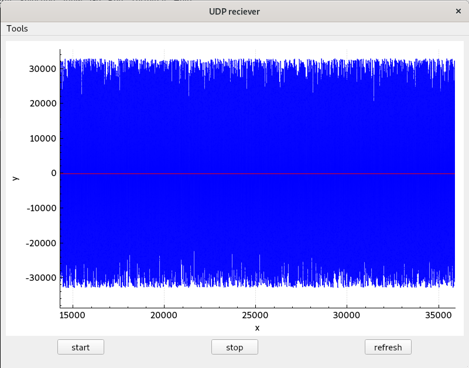

# Simple udp exchanging

## Implementation
The program is intended for unix systems. \
The program consists of simple udp-sender and udp-reciever apps.
- Qt::Core::Network classes are used for processing of data-excanging.

Information is sent/recieved using:
- QUdpSocket
- QNetworkDatagram \

Information is parsed using:
- QByteArray \

Parsed data is visualised using:
- QCustomPlot

## Build
Use makefile:
- **make build** for just building
- **make all** for building and running
- **make stop_sender** for stopping sending (it starts running in background when use **make all**)
- **make clean** for deletion of built apps (run **make stop_sender** before it)

